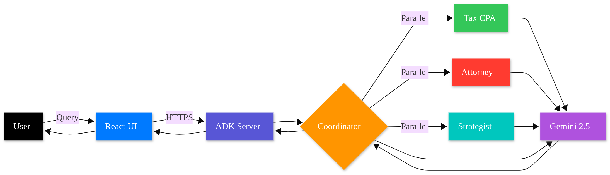
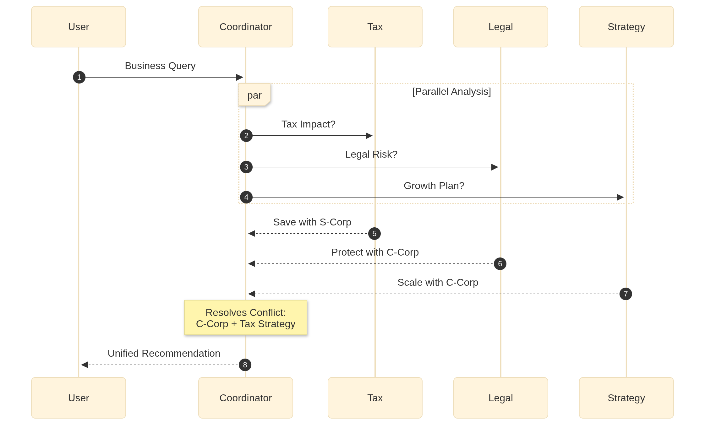

# Better Call Saul - AI Corporate Law Squad

> Multi-agent AI advisory system that coordinates Tax, Legal, and Strategy specialists to provide unified business formation recommendations.

[](https://googlecloudrun.devpost.com/)
[](https://developers.google.com/adk)
[](https://cloud.google.com/run)

---

## The Problem

Starting a business? You ask three professionals what entity to form:

- **Tax CPA:** "Use an LLC for tax savings"
- **Attorney:** "Use a C-Corp for liability protection"  
- **Strategist:** "Use a C-Corp for investor appeal"

Three experts. Three different answers. Zero clarity.

**Why?** Traditional consultants work in silos—each optimizes for their domain without understanding how their advice impacts the others.

---

## The Solution

**Better Call Saul** coordinates three AI specialist agents through an intelligent orchestrator:

**Tax CPA Agent** - Analyzes tax implications, deductions, and strategies  
**Corporate Attorney Agent** - Evaluates legal structures, liability, and compliance  
**Business Strategist Agent** - Assesses growth plans, funding, and scalability  

The **Coordinator Agent** identifies conflicts and synthesizes unified recommendations with explained trade-offs.

**Result:** Integrated strategy instead of conflicting opinions.

---

## Architecture

```
User Query
    ↓
Coordinator Agent
    ├─→ Tax CPA Agent (parallel)
    ├─→ Attorney Agent (parallel)
    └─→ Strategist Agent (parallel)
         ↓
    Conflict Resolution
         ↓
    Unified Strategy
```

### Tech Stack

| Component | Technology |
|-----------|-----------|
| **Frontend** | React + Vite, react-markdown |
| **Backend** | Python 3.12, Google ADK |
| **AI Model** | Gemini 2.5 Flash |
| **Deployment** | Cloud Run (2 services) |
| **Infrastructure** | Cloud Build, Artifact Registry |

---

## Local Development

### Prerequisites

- Python 3.12+
- Node.js 20+
- Google Cloud CLI
- Gemini API key ([get one here](https://aistudio.google.com/app/apikey))

### Backend Setup

```
cd backend
python -m venv venv
source venv/bin/activate 

pip install google-adk python-dotenv

# Create .env file
echo "GOOGLE_API_KEY=your_key_here" > .env
echo "GOOGLE_GENAI_USE_VERTEXAI=FALSE" >> .env

# Start ADK API server
adk api_server --allow_origins="*"
```

Backend runs on `http://localhost:8000`

### Frontend Setup

```
cd frontend
npm install
npm run dev
```

Frontend runs on `http://localhost:5173`

---

## Deploy to Cloud Run

### Backend Deployment

```
cd backend

# Deploy with auto-scaling
gcloud run deploy better-call-saul-backend \
  --source . \
  --region=us-central1 \
  --memory=2Gi \
  --cpu=2 \
  --min-instances=0 \
  --max-instances=10 \
  --allow-unauthenticated \
  --set-env-vars=GOOGLE_API_KEY=YOUR_KEY,GOOGLE_GENAI_USE_VERTEXAI=FALSE
```

### Frontend Deployment

```
cd frontend

# Update backend URL in src/App.jsx
# Replace localhost:8000 with your backend Cloud Run URL

npm run build

# Deploy
gcloud run deploy better-call-saul-frontend \
  --source . \
  --region=us-central1 \
  --memory=512Mi \
  --cpu=1 \
  --min-instances=0 \
  --max-instances=10 \
  --allow-unauthenticated
```

---

## Project Structure

```
better-call-saul/
├── backend/
│   ├── corporate_law_squad/
│   │   ├── agent.py           # Multi-agent definitions
│   │   └── __init__.py
│   ├── Dockerfile             # Backend container config
│   └── .env                   # API keys (gitignored)
├── frontend/
│   ├── src/
│   │   ├── App.jsx            # Main React component
│   │   ├── App.css            # Styling
│   │   └── main.jsx
│   ├── Dockerfile             # Frontend container config
│   └── nginx.conf             # Production server config
└── README.md
```

---

## Key Features

✅ **Parallel Agent Execution** - 2-3x faster than sequential consultation  
✅ **Conflict Resolution** - Identifies contradictions and synthesizes unified advice  
✅ **Session Management** - Maintains conversation context across queries  
✅ **Markdown Rendering** - Professional formatted output with structure  
✅ **Serverless Auto-scaling** - Scales 0-10 instances based on traffic  
✅ **Cost Optimized** - $0 when idle, ~$5/month for moderate usage  


---

## Architecture Diagrams





---

## License

MIT License - see [LICENSE](LICENSE) for details
